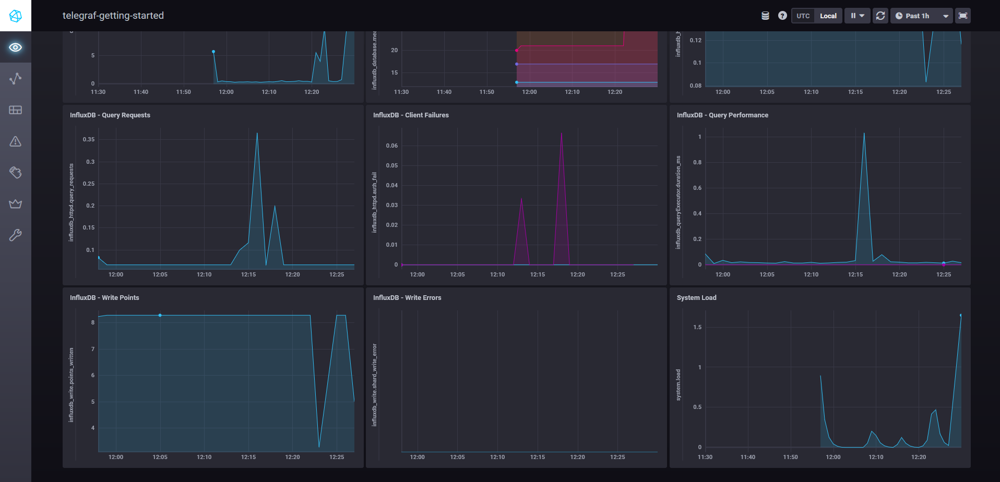
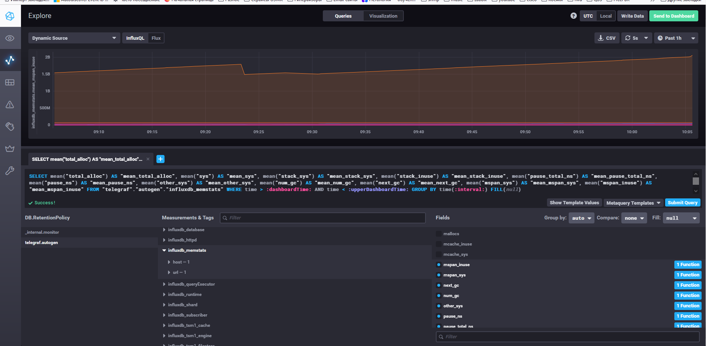
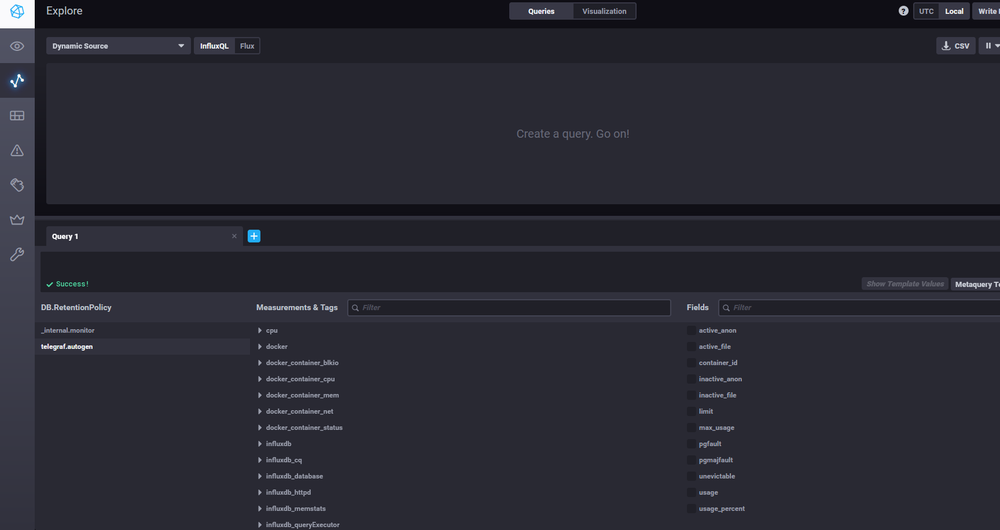
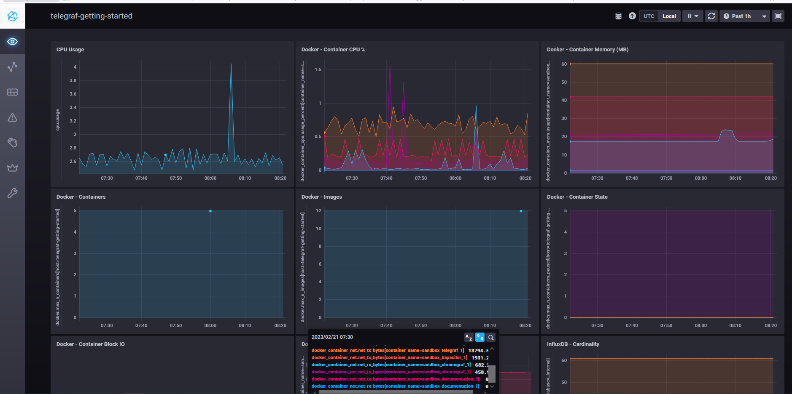

## Обязательные задания

1. Опишите основные плюсы и минусы pull и push систем мониторинга.
Push-модель – когда сервер мониторинга ожидает подключений от агентов для получения метрик.
Достоинства:  
- Более производительна, поскольку UDP легче в передаче пакетов  
- Работает за NAT;  
- Гибкая настройка отправки данных. На каждом клиенте можно задать нужный нам объем данных, частоту отправки, а также конечную точку отправки (набор точек).  

Недостатки:  
- Протокол UDP не гарантирует доставку данных в отличии от TCP  
- При данной схеме сервер не может сказать агентам "подожди, данных много, я не справляюсь". В следствие этого, из-за большого количества информации конечный сервис может не справиться и упасть.  
- Настройка производится на каждом клиенте отдельно. Соответственно при глобальном изменении необходимо зайти на КАЖДЫЙ клиент и перенастроить его.  
- Проблема при верификации данных, следовательно это приводит к проблеме с определением подлинности метрик от источника  

Pull-модель – когда сервер мониторинга сам подключается к агентам мониторинга и забирает данные.  
Достоинства:  
- более высокий уровень контроля за метриками  
- Позволяют гарантировать доставку и корректность данных, благодаря использованию протокола TCP. 
- более высокий уровень безопасности  
- Легче контролировать подлинность данных, т.к только из указанных источников производиться загрузка данных  

Недостатки:  
- Более высокие требования к ресурсам по сравнению с Push в том числе и за счет TCP передачи данных  
- Не работает за NAT без проксирующего сервера.  

2. Какие из ниже перечисленных систем относятся к push модели, а какие к pull? А может есть гибридные?

    - Prometheus - pull с помощью адаптера pushgateway можно заставить работать по модели push  
    - TICK - push  
    - Zabbix - pull и push  
    - VictoriaMetrics - pull и push  
    - Nagios - pull

3. Склонируйте себе [репозиторий](https://github.com/influxdata/sandbox/tree/master) и запустите TICK-стэк, 
используя технологии docker и docker-compose.
```
git clone https://github.com/influxdata/sandbox.git
Cloning into 'sandbox'...
remote: Enumerating objects: 1718, done.
remote: Counting objects: 100% (32/32), done.
remote: Compressing objects: 100% (22/22), done.
remote: Total 1718 (delta 13), reused 25 (delta 10), pack-reused 1686
Receiving objects: 100% (1718/1718), 7.17 MiB | 493.00 KiB/s, done.
Resolving deltas: 100% (946/946), done.
root@dupl-srv:~/homework_mnt# cd ./sandbox/
root@dupl-srv:~/homework_mnt/sandbox# ./sandbox up
Using latest, stable releases
Spinning up Docker Images...
If this is your first time starting sandbox this might take a minute...
Creating network "sandbox_default" with the default driver
Building influxdb
Sending build context to Docker daemon  4.096kB
Step 1/2 : ARG INFLUXDB_TAG
Step 2/2 : FROM influxdb:$INFLUXDB_TAG
1.8: Pulling from library/influxdb
bbeef03cda1f: Pull complete
f049f75f014e: Pull complete
56261d0e6b05: Pull complete
9e6095c9511b: Pull complete
e8aae834f50d: Pull complete
f4ebf85949cb: Pull complete
6ba417bd43bf: Pull complete
da1d9ab0ac81: Pull complete
Digest: sha256:3dd5c0fd48b77b0e4b04d5bd6e983e30a2c66cb8e373f351132e80cd08db5fe1
Status: Downloaded newer image for influxdb:1.8
 ---> 7fe8eaa7401a
Successfully built 7fe8eaa7401a
Successfully tagged influxdb:latest
Building telegraf
Sending build context to Docker daemon  4.096kB
Step 1/2 : ARG TELEGRAF_TAG
Step 2/2 : FROM telegraf:$TELEGRAF_TAG
latest: Pulling from library/telegraf
1e4aec178e08: Pull complete
6c1024729fee: Pull complete
c3aa11fbc85a: Pull complete
148c45678ee9: Pull complete
9494f4cdf48f: Pull complete
785a618ce17a: Pull complete
52926a97fe6d: Pull complete
Digest: sha256:62e35a0740d8b26b712f87ca2f052a78e375f3905fe2df8214b0314e6aa7a63a
Status: Downloaded newer image for telegraf:latest
 ---> d8699c4d8ea4
Successfully built d8699c4d8ea4
Successfully tagged telegraf:latest
Building kapacitor
Sending build context to Docker daemon  4.096kB
Step 1/2 : ARG KAPACITOR_TAG
Step 2/2 : FROM kapacitor:$KAPACITOR_TAG
latest: Pulling from library/kapacitor
6e3729cf69e0: Pull complete
1c825b7c3eae: Pull complete
19a67ff2d29b: Pull complete
6f7efe91e59e: Pull complete
47588d010403: Pull complete
dd480ac8c32b: Pull complete
1cf53978fddf: Pull complete
Digest: sha256:9b5d97af6fbfd6c9d10c5b3e0e17015b87f510d5bb07d64bc31c369770bc25a9
Status: Downloaded newer image for kapacitor:latest
 ---> 71a6b621879d
Successfully built 71a6b621879d
Successfully tagged kapacitor:latest
Building chronograf
Sending build context to Docker daemon  6.144kB
Step 1/4 : ARG CHRONOGRAF_TAG
Step 2/4 : FROM chronograf:$CHRONOGRAF_TAG
latest: Pulling from library/chronograf
8740c948ffd4: Pull complete
108245cd95c1: Pull complete
66dcc8c1bd50: Pull complete
fee0e42ba84d: Pull complete
bc259ad9b709: Pull complete
16d1d7c3e872: Pull complete
Digest: sha256:fabc0897990aebd7d5275b5d4d1e0bcb009fa1bcff9fc5135308ab799ff7a6e4
Status: Downloaded newer image for chronograf:latest
 ---> 582130797032
Step 3/4 : ADD ./sandbox.src ./usr/share/chronograf/resources/
 ---> d543fa0ad438
Step 4/4 : ADD ./sandbox-kapa.kap ./usr/share/chronograf/resources/
 ---> e8c7d57bf4e9
Successfully built e8c7d57bf4e9
Successfully tagged chrono_config:latest
Building documentation
Sending build context to Docker daemon  12.95MB
Step 1/6 : FROM alpine:3.12
3.12: Pulling from library/alpine
1b7ca6aea1dd: Pull complete
Digest: sha256:c75ac27b49326926b803b9ed43bf088bc220d22556de1bc5f72d742c91398f69
Status: Downloaded newer image for alpine:3.12
 ---> 24c8ece58a1a
Step 2/6 : EXPOSE 3010:3000
 ---> Running in 7b5f4e7873c0
Removing intermediate container 7b5f4e7873c0
 ---> 84d6134f2330
Step 3/6 : RUN mkdir -p /documentation
 ---> Running in 5f70b268b4cb
Removing intermediate container 5f70b268b4cb
 ---> 20c03909c30b
Step 4/6 : COPY builds/documentation /documentation/
 ---> 676fc8d91adf
Step 5/6 : COPY static/ /documentation/static
 ---> 0c86169693bc
Step 6/6 : CMD ["/documentation/documentation", "-filePath", "/documentation/"]
 ---> Running in dcb1f5a2bd45
Removing intermediate container dcb1f5a2bd45
 ---> bdc0b8bae3e9
Successfully built bdc0b8bae3e9
Successfully tagged sandbox_documentation:latest
Creating sandbox_documentation_1 ... done
Creating sandbox_influxdb_1      ... done
Creating sandbox_telegraf_1      ... done
Creating sandbox_kapacitor_1     ... done
Creating sandbox_chronograf_1    ... done
Opening tabs in browser...
./sandbox: line 91: xdg-open: command not found

docker ps
CONTAINER ID   IMAGE                   COMMAND                  CREATED              STATUS              PORTS                                                                                                                             NAMES
27c8c63cd2ae   chrono_config           "/entrypoint.sh chro…"   About a minute ago   Up About a minute   0.0.0.0:8888->8888/tcp, :::8888->8888/tcp                                                                                         sandbox_chronograf_1
a041f84a893f   telegraf                "/entrypoint.sh tele…"   About a minute ago   Up About a minute   8092/udp, 8125/udp, 8094/tcp                                                                                                      sandbox_telegraf_1
71d4618e7a33   kapacitor               "/entrypoint.sh kapa…"   About a minute ago   Up About a minute   0.0.0.0:9092->9092/tcp, :::9092->9092/tcp                                                                                         sandbox_kapacitor_1
ea7c616d16ce   influxdb                "/entrypoint.sh infl…"   About a minute ago   Up About a minute   0.0.0.0:8082->8082/tcp, :::8082->8082/tcp, 0.0.0.0:8086->8086/tcp, :::8086->8086/tcp, 0.0.0.0:8089->8089/udp, :::8089->8089/udp   sandbox_influxdb_1
5c7401ce0610   sandbox_documentation   "/documentation/docu…"   About a minute ago   Up About a minute   0.0.0.0:3010->3000/tcp, :::3010->3000/tcp      
```

В виде решения на это упражнение приведите выводы команд с вашего компьютера (виртуальной машины):

    - curl http://localhost:8086/ping
    - curl http://localhost:8888
    - curl http://localhost:9092/kapacitor/v1/ping

```
curl http://localhost:8888
<!DOCTYPE html><html><head><link rel="stylesheet" href="/index.c708214f.css"><meta http-equiv="Content-type" content="text/html; charset=utf-8"><title>Chronograf</title><link rel="icon shortcut" href="/favicon.70d63073.ico"></head><body> <div id="react-root" data-basepath=""></div> <script type="module" src="/index.e81b88ee.js"></script><script src="/index.a6955a67.js" nomodule="" defer></script> </body></html>root@dupl-srv:~/homework_mnt/sandbox/telegraf#

root@dupl-srv:~/homework_mnt/sandbox/telegraf# curl -l -I localhost:8086/ping
HTTP/1.1 204 No Content
Content-Type: application/json
Request-Id: 092649db-b103-11ed-8102-0242ac160003
X-Influxdb-Build: OSS
X-Influxdb-Version: 1.8.10
X-Request-Id: 092649db-b103-11ed-8102-0242ac160003
Date: Mon, 20 Feb 2023 09:43:31 GMT

root@dupl-srv:~/homework_mnt/sandbox/telegraf# curl localhost:8086/ping

root@dupl-srv:~/homework_mnt/sandbox/telegraf# curl -sl -I http://localhost:9092/kapacitor/v1/ping
HTTP/1.1 204 No Content
Content-Type: application/json; charset=utf-8
Request-Id: 21016fa7-b103-11ed-80f8-0242ac160005
X-Kapacitor-Version: 1.6.5
Date: Mon, 20 Feb 2023 09:44:11 GMT

root@dupl-srv:~/homework_mnt/sandbox/telegraf# curl  http://localhost:9092/kapacitor/v1/ping
root@dupl-srv:~/homework_mnt/sandbox/telegraf#
root@dupl-srv:~/homework_mnt/sandbox/telegraf#
root@dupl-srv:~/homework_mnt/sandbox/telegraf# netstat -tulpn
Active Internet connections (only servers)
Proto Recv-Q Send-Q Local Address           Foreign Address         State       PID/Program name
tcp        0      0 0.0.0.0:8888            0.0.0.0:*               LISTEN      41641/docker-proxy
tcp        0      0 0.0.0.0:9092            0.0.0.0:*               LISTEN      41461/docker-proxy
tcp        0      0 0.0.0.0:22              0.0.0.0:*               LISTEN      25120/sshd: /usr/sb
tcp        0      0 0.0.0.0:3010            0.0.0.0:*               LISTEN      41146/docker-proxy
tcp        0      0 127.0.0.1:45779         0.0.0.0:*               LISTEN      704/containerd
tcp        0      0 127.0.0.53:53           0.0.0.0:*               LISTEN      659/systemd-resolve
tcp        0      0 0.0.0.0:8086            0.0.0.0:*               LISTEN      41221/docker-proxy
tcp        0      0 0.0.0.0:8082            0.0.0.0:*               LISTEN      41249/docker-proxy
tcp6       0      0 :::8888                 :::*                    LISTEN      41648/docker-proxy
tcp6       0      0 :::9092                 :::*                    LISTEN      41471/docker-proxy
tcp6       0      0 :::22                   :::*                    LISTEN      25120/sshd: /usr/sb
tcp6       0      0 :::3010                 :::*                    LISTEN      41153/docker-proxy
tcp6       0      0 :::8086                 :::*                    LISTEN      41228/docker-proxy
tcp6       0      0 :::8082                 :::*                    LISTEN      41256/docker-proxy
udp        0      0 0.0.0.0:8089            0.0.0.0:*                           41187/docker-proxy
udp        0      0 127.0.0.53:53           0.0.0.0:*                           659/systemd-resolve
udp6       0      0 :::8089                 :::*                                41202/docker-proxy

```

Понятия не имею почему отсутствует контент. Сервисы при этом стартуют абсолютно все (нетстат прикладываю). И все доступны. Пробовал на чистой ubuntu, debian, centos  

А также скриншот веб-интерфейса ПО chronograf (`http://localhost:8888`). 



P.S.: если при запуске некоторые контейнеры будут падать с ошибкой - проставьте им режим `Z`, например
`./data:/var/lib:Z`

4. Перейдите в веб-интерфейс Chronograf (`http://localhost:8888`) и откройте вкладку `Data explorer`.

    - Нажмите на кнопку `Add a query`
    - Изучите вывод интерфейса и выберите БД `telegraf.autogen`
    - В `measurments` выберите mem->host->telegraf_container_id , а в `fields` выберите used_percent. 
    Внизу появится график утилизации оперативной памяти в контейнере telegraf.
    - Вверху вы можете увидеть запрос, аналогичный SQL-синтаксису. 
    Поэкспериментируйте с запросом, попробуйте изменить группировку и интервал наблюдений.

Для выполнения задания приведите скриншот с отображением метрик утилизации места на диске 
(disk->host->telegraf_container_id) из веб-интерфейса.

Видимо, интерфейс существенно поменяли. Ничего подобного не нашел. Нашел где это можно накрутить:


5. Изучите список [telegraf inputs](https://github.com/influxdata/telegraf/tree/master/plugins/inputs). 
Добавьте в конфигурацию telegraf следующий плагин - [docker](https://github.com/influxdata/telegraf/tree/master/plugins/inputs/docker):
```
[[inputs.docker]]
  endpoint = "unix:///var/run/docker.sock"
```

Дополнительно вам может потребоваться донастройка контейнера telegraf в `docker-compose.yml` дополнительного volume и 
режима privileged:
```
  telegraf:
    image: telegraf:1.4.0
    privileged: true
    volumes:
      - ./etc/telegraf.conf:/etc/telegraf/telegraf.conf:Z
      - /var/run/docker.sock:/var/run/docker.sock:Z
    links:
      - influxdb
    ports:
      - "8092:8092/udp"
      - "8094:8094"
      - "8125:8125/udp"
```

После настройки перезапустите telegraf, обновите веб интерфейс и приведите скриншотом список `measurments` в 
веб-интерфейсе базы telegraf.autogen . Там должны появиться метрики, связанные с docker.

Факультативно можете изучить, какие метрики собирает telegraf после выполнения данного задания.

После проведенных выше шагов все взлетело. :Z ни на что не влияет в моем случае. Предполажу, что это нужно селинукс, а у меня ось Убунту.
  
  
